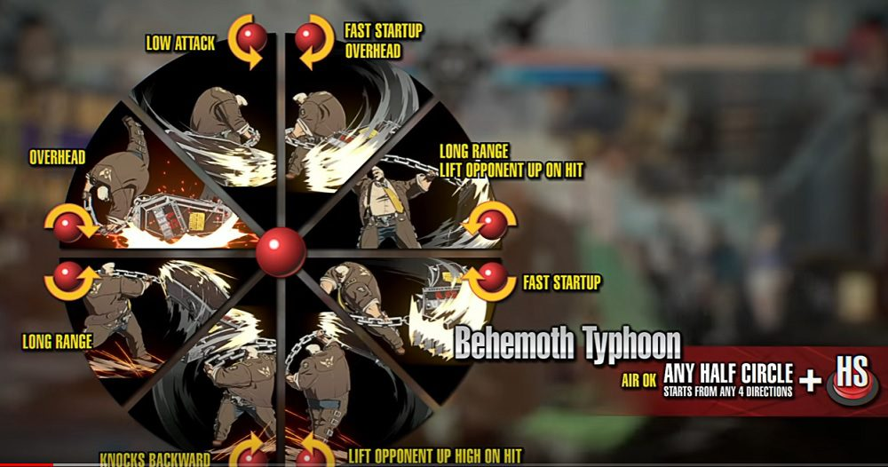

# VimBox

(GitHub supports STL model viewing, you can click on any of the model files to preview them.)

I’ve spent the last few years almost exclusively playing fighting games. I’ve also spent the last *couple* of years daily-driving various Linux distros. With these in mind, it’s only inevitable that I concoct an idea: find a way to combine the two.

My fighting game journey started with Kazuya in Smash, which inspired me to pick up Armor King in Tekken 7. With my trusty, not-yet-worn-out Nintendo Switch Pro Controller, I set out to play ranked and forget that a lot of moves in this game are plus on block. I eventually branched out and found communities in Guilty Gear XX Accent Core Plus R, Street Fighter III: 3rd Strike, and Street Fighter 6.

My Linux journey started off with a CompTIA Linux+ class, where we were instructed to use CentOS. I remember our professor basically held our hands and guided us through the final as a sort of review, but it felt like he was simply giving us the answers. I ended up beginning my daily-driving journey with Mint on August 15, 2023, before moving to Arch (btw) months later. That’s what got me into rolling-release distros, and I now happily daily-drive EndeavourOS.

When Street Fighter 6 finally came out, I stayed up past midnight grinding Kimberly combo trials. I made it to Master, then the highest rank in the game, then plummeted down from 1500 MR (the starting point) to around 1200. This discouraged me from playing more, so I decided to give Guilty Gear Strive a shot.

During my time in the Linux+ class, I was introduced to two terminal text editors: Vim and Nano. The simple idea of needing to press an extra key to start editing my text was absolutely unbearable to me then, so I did all of my editing with Nano. I even edited personal projects with it until the aforementioned mentality wore off and I told myself “what have I got to lose?”

I started out Strive with Asuka, without a doubt the most complicated and difficult character in the game, because I thought I was him. As it turns out, I was very clearly not. I then switched to Giovanna, taking the Dustloop wiki’s advice to use a dash button in a state of being humble. I tried out Sin for a bit as well, but then I decided “to hell with it” and tried out the White Wild Assault characters. I first tried Nagoriyuki, but he was too slow and I couldn’t manage the ~~edging meter~~ Blood Gauge. Then on my second attempt with Goldlewis, something clicked. I knew he was the one. I knew he was my main.

Vim wasn’t actually that hard to get into, but I only say that because I learned how to exit beforehand. Over time, I gradually got used to commands like dd, y2j, etc., and while I’m not a Vim god by any means, I definitely benefited from the motions way more than they got in my way.

The thing about Goldlewis is that his command inputs are unlike that of any other character. See the following:

At this point, I had gotten myself a PS5 controller, though I admittedly used (and still use) the analog stick rather than the D-pad. I had messed around on keyboard before as a makeshift leverless, and the idea of doing Behemoths was honestly not that daunting when not one-to-one with the controller motions. Then a question sparked in my head: What if I used Vim’s HJKL to do Behemoth Typhoons?

https://github.com/user-attachments/assets/aec72b09-f46c-46ae-88e4-938c6b7e7d3b

Not as hard as I was expecting. Not like I would ever actually play online with this.

I had had experience with CAD software, though I have to admit that I forgot pretty much everything when I started designing the box. The original design was WAY bigger, with 30 mm buttons. I had to shrink it down to make it fit in my university’s 3D printers. I modeled drafts, asked for help from friends and Discord servers, and ordered the parts way before I could build it. Then on Wednesday, October 1, 2025, I got to work. Hours later, it was real.

In between ordering the parts and building the thing, Riot Games announced a closed beta for their new fighting game, 2XKO. With the way Riot loves funding university esports teams, I got to grinding. I had already installed a dual-boot for Windows in preparation, so I didn’t need to worry about that. The great thing about 2XKO is that it has no command inputs, just special buttons and directions. I wouldn’t have minded to learn how to do a DP on my VimBox, but this simplification made it easy to pick up. I peaked at Emerald 2 before the Early Access maintenance started.

## Assembly

Any item, tool or step marked with an asterisk is optional, unless you intend on using your VimBox on PlayStations.

### Items

* [Eight Crown/Samducksa SDB-202 MX 24mm Screwbutton Green](https://focusattack.com/crown-samducksa-sdb-202-mx-24mm-screwbutton-green/) (for the face buttons)
* Four Cherry MX keyboard switches (can be ordered as extras with 24mm buttons)
* [Five Sanwa SDM 18mm Pushbutton - White](https://focusattack.com/sanwa-sdm-18mm-pushbutton-white/) (for the side buttons)
* [Tai-Hao Neon Green Row 2 Blank 4 Key OEM Profile TPR Rubber Keycap Set](https://mechanicalkeyboards.com/products/tai-hao-4-key-tpr-blank-rubber-keycap-set-neon-green-row-2) (for the keys)
* [Any Raspberry Pi Pico variant](https://www.raspberrypi.com/products/raspberry-pi-pico/) (I used a Pico W, but you won’t need wireless capabilities)
* USB-A to Micro-USB Cable that can transfer data (this can be tested during step 1)
* \*[USB Type A Female Breakout](https://www.sparkfun.com/sparkfun-usb-type-a-female-breakout.html)
* \*PS5 Adapter such as [this one by Mayflash](https://www.amazon.com/dp/B01N66G4HE) or [the Brook Wingman](https://www.brookaccessory.com/products/wingmanfgc/index.html)
* Four M3 6mm Heat Set Inserts
* [Four M3 12mm screws](https://www.homedepot.com/p/321071710) (these have extra length to accomodate for the lid)
* Four M2 4mm Heat Set Inserts
* [Four M2-0.4×4mm Screws](https://www.homedepot.com/p/310723420)
* [Vim sticker](https://www.redbubble.com/i/sticker/VIM-by-arthurreeder/16789391.O9UDB) for garnish

### Tools

* Soldering workstation
* Tool to insert heat set inserts
* Lots of solder
* One long wire for ground
* 17 female-to-male wires
* \*4 female-to-female wires
* 2 sets of header pins (unless you get a Pico with headers)
* \*1 set of 4 header pins
* Breadboard (to solder header pins)

### Steps

You will need experience soldering, or to ask a friend for help.

1. Flash the appropriate image from [here](https://gp2040-ce.info/downloads/) using [these instructions](https://gp2040-ce.info/installation/).
2. Attach the keycaps onto the switches, preferably all in matching orientation using the pins on the bottom as a point of reference.
3. 3D print the two models. I used green PLA filament, and the lid took ~2 hours whereas the box took ~4.5 hours.
4. Lay the lid face down behind the box with the switch holes on the right.
5. Lay the box face up with the USB output facing away from you.
6. Insert the buttons and switches into the appropriate holes before soldering, preferably all in matching orientation. The 24 mm buttons will have plastic nuts on the bottom to keep them in place.
7. Insert the heat set inserts. Put the M3 ones in the top holes of the box, and the M2 ones in the smaller holes close to the USB output. A tutorial is available [here](https://www.youtube.com/watch?v=hwq15qH-4x4).
8. If not already present, solder on header pins to the Raspberry Pi.
9. If room is available, screw the Raspberry Pi into the M2 heat set insert holes. If not, plug in the USB cable from outside to keep it in place.
10. \*Use the breadboard to solder the 4 header pins onto the USB breakout board.
11. \*Attach the female-to-female wires between the pins of the USB breakout board and the Raspberry Pi using [this](https://gp2040-ce.info/controller-build/usb-host) as a point of reference.
12. Cut, strip and solder the ground wire repeatedly, and attach it to one pin of each button. The 24 mm buttons will have an indication of which pin is negative, and either pin can be used for the switches and 18mm buttons. Make sure that the wires form a chain between the buttons, and that all 17 buttons are accounted for.
13. For each of your female-to-male wires:
  * Cut off the male end, making sure it’s long enough for the connection between the Raspberry Pi and each button.
  * Strip the male end enough to expose the wire (~1 cm).
  * Solder the male end onto the appropriate button.
  * Attach the female end onto the appropriate header of the Raspberry Pi.
14. Attach a female-to-male wire to the last ground wire with the same method as above.
15. \*Plug in your Brook converter/Mayflash adapter/etc. to the USB breakout board.

I have SOCD set to left + right = neutral, and up + down = up. My buttons are laid out like this (reading order):

| Physical Button | Button   | Pin Number |
|-----------------|----------|------------|
| 24 mm 1         | L2/LT    | GP09       |
| 24 mm 2         | R2/RT    | GP08       |
| 24 mm 3         | B3/X     | GP10       |
| 24 mm 4         | B4/Y     | GP11       |
| 24 mm 5         | L1/LB    | GP13       |
| 24 mm 6         | R1/RB    | GP12       |
| 24 mm 7         | B1/A     | GP06       |
| 24 mm 8         | B2/B     | GP07       |
| Switch 1        | LEFT     | GP05       |
| Switch 2        | DOWN     | GP03       |
| Switch 3        | UP       | GP02       |
| Switch 4        | RIGHT    | GP04       |
| 18 mm 1         | S1/Back  | GP16       |
| 18 mm 2         | S2/Start | GP17       |
| 18 mm 3         | L3/LS    | GP18       |
| 18 mm 4         | R3/RS    | GP19       |
| 18 mm 5         | Guide/A1 | GP20       |

If dissatisfied with this layout, it can be changed either through the GP2040-CE settings or by physically re-arranging the pins.
